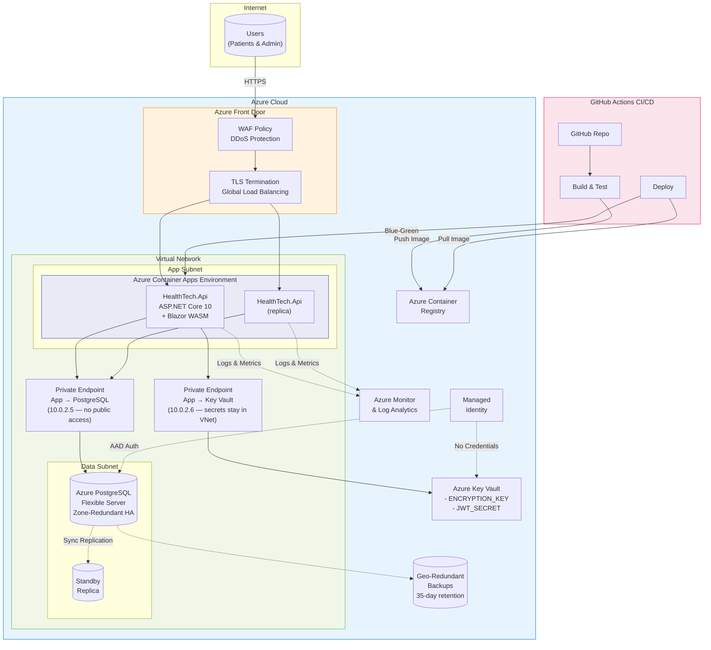
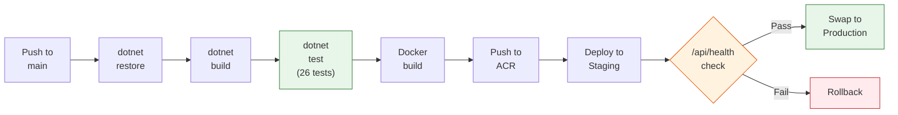
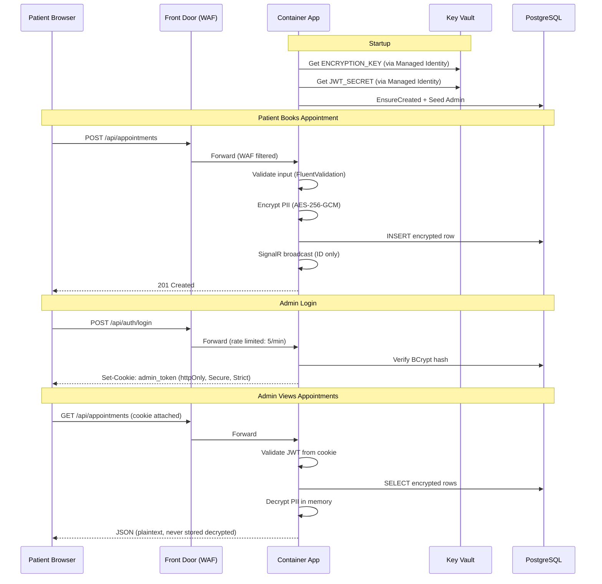

# Azure Deployment Architecture

## Infrastructure Overview

```mermaid
graph TB
    subgraph Internet
        U[("Users<br/>(Patients & Admin)")]
    end

    subgraph Azure["Azure Cloud"]
        subgraph FrontDoor["Azure Front Door"]
            WAF["WAF Policy<br/>DDoS Protection"]
            TLS["TLS Termination<br/>Global Load Balancing"]
        end

        subgraph VNet["Virtual Network"]
            subgraph AppSubnet["App Subnet"]
                subgraph ContainerApps["Azure Container Apps Environment"]
                    API["HealthTech.Api<br/>ASP.NET Core 10<br/>+ Blazor WASM"]
                    API2["HealthTech.Api<br/>(replica)"]
                end
            end

            subgraph DataSubnet["Data Subnet"]
                PG[("Azure PostgreSQL<br/>Flexible Server<br/>Zone-Redundant HA")]
                PG_Standby[("Standby<br/>Replica")]
            end

            PE1["Private Endpoint<br/>App → PostgreSQL<br/>(10.0.2.5 — no public access)"]
            PE2["Private Endpoint<br/>App → Key Vault<br/>(10.0.2.6 — secrets stay in VNet)"]
        end

        KV["Azure Key Vault<br/>- ENCRYPTION_KEY<br/>- JWT_SECRET"]
        ACR["Azure Container<br/>Registry"]
        MI["Managed<br/>Identity"]
        Monitor["Azure Monitor<br/>& Log Analytics"]
        Backup[("Geo-Redundant<br/>Backups<br/>35-day retention")]
    end

    subgraph CICD["GitHub Actions CI/CD"]
        GH["GitHub Repo"]
        CI["Build & Test"]
        Deploy["Deploy"]
    end

    U -->|HTTPS| WAF
    WAF --> TLS
    TLS --> API
    TLS --> API2

    API --> PE1
    API2 --> PE1
    PE1 --> PG
    PG -.->|Sync Replication| PG_Standby
    PG -.-> Backup

    API --> PE2
    PE2 --> KV
    MI -.->|No Credentials| KV
    MI -.->|AAD Auth| PG

    API -.->|Logs & Metrics| Monitor
    API2 -.->|Logs & Metrics| Monitor

    GH --> CI
    CI -->|Push Image| ACR
    Deploy -->|Pull Image| ACR
    Deploy -->|Blue-Green| ContainerApps

    style Azure fill:#e8f4fd,stroke:#0078d4
    style VNet fill:#f0f7e8,stroke:#5bb75b
    style FrontDoor fill:#fff3e0,stroke:#ff8c00
    style ContainerApps fill:#e8eaf6,stroke:#3f51b5
    style CICD fill:#fce4ec,stroke:#e91e63
```

## Security Layers

```mermaid
graph LR
    subgraph Layer1["Network Layer"]
        FD["Front Door WAF<br/>DDoS + OWASP rules"]
        NSG["Network Security Groups<br/>Subnet isolation"]
        PE["Private Endpoints<br/>No public DB access"]
    end

    subgraph Layer2["Platform Layer"]
        MI["Managed Identity<br/>No stored credentials"]
        KV["Key Vault<br/>Key rotation"]
        TLS["TLS 1.3 Everywhere"]
    end

    subgraph Layer3["Application Layer"]
        AES["AES-256-GCM<br/>PII encrypted at rest"]
        JWT["httpOnly Cookie JWT<br/>8hr expiry"]
        RL["Rate Limiting<br/>5 req/min on login"]
        VAL["Input Validation<br/>FluentValidation"]
        AUDIT["Audit Logging<br/>All admin actions"]
        HEADERS["Security Headers<br/>CSP, HSTS, X-Frame"]
    end

    Layer1 --> Layer2 --> Layer3

    style Layer1 fill:#ffebee,stroke:#c62828
    style Layer2 fill:#fff3e0,stroke:#e65100
    style Layer3 fill:#e8f5e9,stroke:#2e7d32
```

## CI/CD Pipeline

```mermaid
graph LR
    A["Push to<br/>main"] --> B["dotnet<br/>restore"]
    B --> C["dotnet<br/>build"]
    C --> D["dotnet<br/>test<br/>(26 tests)"]
    D --> E["Docker<br/>build"]
    E --> F["Push to<br/>ACR"]
    F --> G["Deploy to<br/>Staging"]
    G --> H{"/api/health<br/>check"}
    H -->|Pass| I["Swap to<br/>Production"]
    H -->|Fail| J["Rollback"]

    style D fill:#e8f5e9,stroke:#2e7d32
    style H fill:#fff3e0,stroke:#e65100
    style I fill:#e8f5e9,stroke:#2e7d32
    style J fill:#ffebee,stroke:#c62828
```

## Data Flow

```mermaid
sequenceDiagram
    participant P as Patient Browser
    participant FD as Front Door (WAF)
    participant App as Container App
    participant KV as Key Vault
    participant DB as PostgreSQL

    Note over App,KV: Startup
    App->>KV: Get ENCRYPTION_KEY (via Managed Identity)
    App->>KV: Get JWT_SECRET (via Managed Identity)
    App->>DB: EnsureCreated + Seed Admin

    Note over P,DB: Patient Books Appointment
    P->>FD: POST /api/appointments
    FD->>App: Forward (WAF filtered)
    App->>App: Validate input (FluentValidation)
    App->>App: Encrypt PII (AES-256-GCM)
    App->>DB: INSERT encrypted row
    App->>App: SignalR broadcast (ID only)
    App-->>P: 201 Created

    Note over P,DB: Admin Login
    P->>FD: POST /api/auth/login
    FD->>App: Forward (rate limited: 5/min)
    App->>DB: Verify BCrypt hash
    App-->>P: Set-Cookie: admin_token (httpOnly, Secure, Strict)

    Note over P,DB: Admin Views Appointments
    P->>FD: GET /api/appointments (cookie attached)
    FD->>App: Forward
    App->>App: Validate JWT from cookie
    App->>DB: SELECT encrypted rows
    App->>App: Decrypt PII in memory
    App-->>P: JSON (plaintext, never stored decrypted)
```
